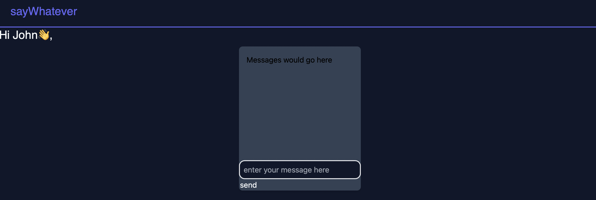

## sayWhatever
___

sayWhatever is an [nwHacks 2023](https://www.nwhacks.io/) project. 
SayWhatever is an innovative chat application that utilizes the latest technologies such as `Flask`, `WebSockets`, `React`, and `OpenAI` to provide users with a unique and seamless communication experience.

### Mission 🚀🚀

Our mission is to revolutionize the way people communicate online by empowering them with the ability to easily summarize and understand the conversation so far. With SayWhatever, users can stay on top of the conversation and never miss out on important information again.

We understand the importance of real-time communication and that's why we've built our application using WebSockets, which allows for instant messaging without the need for constant refreshes. Our application is also built using `React`, which provides a smooth and responsive user interface.

### Feature ✨✨

Our chat app is also integrated with the `OpenAI` API, which allows us to provide users with a text completion feature that summarizes the conversation so far. This feature is powered by state-of-the-art machine learning models and is designed to help users understand and stay on top of the conversation.

### About Us 🙌🙌

We are a team of experienced developers, designers and machine learning experts who are passionate about creating innovative and user-friendly applications. With SayWhatever, we strive to make online communication simple, efficient and enjoyable for everyone.

>Join the SayWhatever community today and experience the future of online communication!
